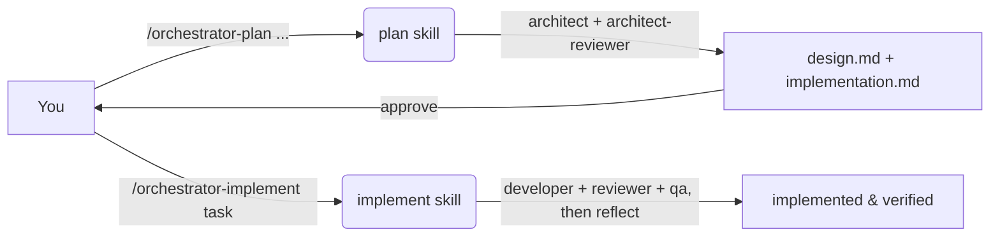

# Agent Orchestration — User Guide

A two-phase, multi-agent system for **Claude Code** that turns a plain-language request into
a designed, planned, implemented, and tested feature. You drive it with two slash commands;
the orchestrators delegate to specialized subagents.

## How it maps onto Claude Code

A Claude Code **subagent cannot spawn other subagents** — only the main session has the Task
tool. So the orchestrators are **skills** (they run in the main session and delegate), and the
specialized workers are **subagents**.

| Concept | Mechanism | Where |
| --- | --- | --- |
| Planning orchestrator | Skill → `/orchestrator-plan` | `.claude/skills/orchestrator-plan/SKILL.md` |
| Implementation orchestrator | Skill → `/orchestrator-implement` | `.claude/skills/orchestrator-implement/SKILL.md` |
| Worker agents | Subagents | `.claude/agents/*.md` |
| Shared conventions | Plain file the agents read | `.claude/orchestration/conventions.md` |
| Logging helper | Bash script | `.claude/orchestration/append-log.sh` |
| Institutional knowledge | Markdown file | `AGENTS.md` (repo root) |

```
.claude/
├─ agents/
│  ├─ architect.md            # opus  — writes design.md & implementation.md
│  ├─ architect-reviewer.md   # sonnet — grades design / plan
│  ├─ developer.md            # sonnet — implements a step + tests
│  ├─ developer-reviewer.md   # sonnet — reviews the step's diff
│  ├─ qa.md                   # sonnet — verifies & marks a step done
│  └─ reflect.md              # sonnet — captures learnings into AGENTS.md
├─ skills/
│  ├─ orchestrator-plan/SKILL.md
│  └─ orchestrator-implement/SKILL.md
└─ orchestration/
   ├─ conventions.md          # artifact layout, step format, response schema, logging
   └─ append-log.sh
```

## The two phases



1. **Planning** — `/orchestrator-plan` derives a `task_name`, then loops `architect` (writer)
   and `architect-reviewer` (grader) until you approve `design.md` and `implementation.md`.
2. **Implementation** — `/orchestrator-implement` reads the plan and runs each step through
   `developer` → `developer-reviewer` → `qa`, then `reflect` captures learnings.

## Artifacts each task produces

Everything lives under `docs/plans/{task_name}/` — see
[`.claude/orchestration/conventions.md`](.claude/orchestration/conventions.md) for the full
table, the `implementation.md` step format, the subagent response schema, and the logging
command.

## How to use it

### Phase 1 — Planning

```
/orchestrator-plan a weekly parser that pulls dishes, prices, weight and category from
restaurant websites, respects robots.txt and rate limits, and skips venues flagged
"do not update" in the admin panel
```

What happens: the skill picks a `task_name` (e.g., `menu-parser`), has `architect` write
`design.md`, surfaces any `design-questions.md` for you to answer, has `architect-reviewer`
grade it (max 3 revise cycles), and presents the design for approval:

```
Approve the design.
```

Then the same loop produces and grades `implementation.md`, and the skill hands off.

Useful mid-flight replies:
```
Revise the design: distances must be computed locally with Haversine, no paid geo APIs.
Approve the plan.
Change the task name to menu-ingest.
```

### Phase 2 — Implementation

```
/orchestrator-implement menu-parser
```

The skill verifies the plan exists, builds a TODO per step, and runs each step through
developer → reviewer → QA, then `reflect`. Re-running on a half-finished task asks whether to
resume or restart.

### Single-agent shortcuts

`@`-mention any worker subagent for a one-off:
```
@architect draft a design for an offline rating cache — task name rating-cache
@architect-reviewer review docs/plans/rating-cache/implementation.md and grade it
@qa verify Step 3 of menu-parser
```

## Models

Claude Code accepts the aliases `opus`, `sonnet`, `haiku` (or full ids like
`claude-opus-4-8`). The agents use:

| Agent | model |
| --- | --- |
| `architect` | `opus` |
| `architect-reviewer`, `developer`, `developer-reviewer`, `qa`, `reflect` | `sonnet` |

> **Note on `opus 4.8 max` / `sonnet ultracode`:** these are **not** valid Claude Code model
> values, so they aren't used. For maximum Opus reasoning, run the session on Opus and toggle
> **`/fast`** (Opus with faster output). The orchestrator skills run on the **session model**
> (skills can't set their own), so start a planning session on Opus for the strongest
> coordination; subagents always use their own `model:` regardless.

## Conventions enforced by the agents

- **Orchestrators coordinate; workers do the work.** The skills delegate via the Task tool and
  relay results.
- **`qa` runs on every step** — even no-code steps — and is the only agent that marks a step
  `[x] done`.
- **The reviewer is strict by design:** any suggestion → `needs_revision`; the developer fixes
  it or declines with a reason.
- **Logging is append-only via `bash`** and **capability-gated**: only the agents that have the
  `Bash` tool (`developer`, `developer-reviewer`, `qa`) write the log; the Bash-free agents
  (`architect`, `architect-reviewer`, `reflect`) skip it and rely on their final message (and
  notes). Never `Edit` the log. Subagents return only their final message, so they put what
  matters there.
- **Transient review files** (`design-review.md`, `implementation-review.md`) are deleted by the
  **orchestrator** before handover — the planning-phase agents (`architect`, `architect-reviewer`)
  have no delete capability, so the skill does this housekeeping itself.
- **Loop-breaking:** design/plan review is capped at 3 cycles; if grades stall, the
  orchestrator asks you.

## Setup

1. Keep the `.claude/` tree above in your repo (committed so your team shares it).
2. The log script is `bash`; on Windows run via Git Bash or WSL. Subagents with the `Bash`
   tool call it for you.
3. Nothing else is required — `docs/plans/{task_name}/` is created on first use.

## Quick reference

```
# Plan a feature
/orchestrator-plan <describe the feature in plain language>

# Approve when asked
Approve the design.   /   Approve the plan.

# Implement after approval
/orchestrator-implement <task_name>
```
