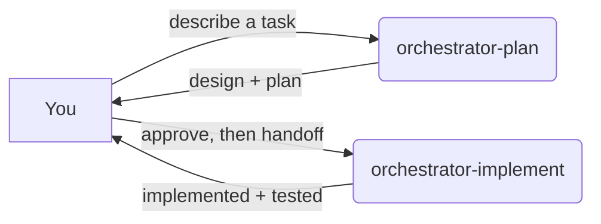

# Agent Orchestration — User Guide

A two-phase, multi-agent system for turning a plain-language request into a designed,
planned, implemented, tested feature. You drive it with a few prompts; the orchestrators
do the rest by delegating to specialized sub-agents.

> **Deterministic delegation, not magic.** Each agent has one job, a fixed set of tools,
> and a strict "coordinator vs. worker" boundary. The orchestrators never touch code or
> files directly — they only delegate.

---

## 1. The two phases



1. **Planning** — `orchestrator-plan` produces `design.md` and `implementation.md`, iterating
   with `architect` (writer) and `architect-reviewer` (grader) until you approve.
2. **Implementation** — `orchestrator-implement` executes the plan step by step using
   `developer` → `developer-reviewer` → `qa`, then `reflect` captures learnings.

---

## 2. The agents

| Agent | Role | Model* |
| --- | --- | --- |
| `orchestrator-plan` | Coordinates the planning phase | `opus 4.8 max` |
| `orchestrator-implement` | Coordinates the implementation phase | `sonnet 4.6` |
| `orchestrator-helper` | Cheap helper: reads/parses plan, extracts steps | `haiku 4.5` |
| `architect` | Writes `design.md` and `implementation.md` | `opus 4.8 max` |
| `architect-reviewer` | Grades the design / plan (letter grade) | `sonnet 4.6` |
| `developer` | Implements a step; writes tests (SOLID/DRY) | `sonnet ultracode` |
| `developer-reviewer` | Reviews the step's uncommitted changes | `sonnet 4.6` |
| `qa` | Sets up env, runs tests, verifies, marks step done | `sonnet 4.6` |
| `reflect` | Captures learnings into `AGENTS.md` after a session | `sonnet 4.6` |

\* See [§6 Model configuration](#6-model-configuration) — `opus 4.8 max` and `sonnet ultracode`
are aspirational labels with documented fallbacks.

Files live in `.github/agents/`:

```
.github/agents/
├─ orchestrator-plan.agent.md
├─ orchestrator-implement.agent.md
├─ orchestrator-helper.agent.md
├─ architect.agent.md
├─ architect-reviewer.agent.md
├─ developer.agent.md
├─ developer-reviewer.agent.md
├─ qa.agent.md
├─ reflect.agent.md
├─ shared/
│  ├─ orchestrator.shared.md            # related docs + best practices (sub-agents)
│  └─ orchestrator-log-structure.shared.md  # logging + persistent memory
└─ scripts/
   ├─ append-log.sh                      # append a debug entry to agents-log.md
   └─ extract-step.sh                    # pull one step's markdown out of implementation.md
```

---

## 3. Artifacts each task produces

Everything for a task lives under `docs/plans/{task_name}/`:

| File | Written by | Purpose |
| --- | --- | --- |
| `design.md` | `architect` | High-level design (source of truth) |
| `implementation.md` | `architect` | Numbered, checkable steps |
| `design-questions.md` | `architect` | Open questions for you (transient) |
| `design-review.md` | `architect-reviewer` | Graded design review (deleted before handoff) |
| `implementation-review.md` | `architect-reviewer` | Graded plan review (deleted before handoff) |
| `implementation-design-issues.md` | `architect` | Design flaws found while planning |
| `agents-log.md` | all sub-agents | Append-only debug log (never read back) |
| `notes/{agent_name}.md` | each sub-agent | Concise persistent memory |

`{task_name}` is a short, hyphenated slug the planner derives from your request
(e.g., `menu-parser`, `geo-distance`).

---

## 4. How to use it — prompts & examples

You invoke an agent with `@<agent-name>` followed by what you want.

### Phase 1 — Planning

Start with a plain description of the feature. The planner names the task, then drives
design → review → plan → review.

```
@orchestrator-plan I want a weekly parser that pulls dishes, prices, weight and
category from restaurant websites, respects robots.txt and rate limits, and skips
venues flagged "do not update" in the admin panel.
```

What happens:
1. Planner picks a `task_name` (e.g., `menu-parser`) and tells you.
2. `architect` writes `docs/plans/menu-parser/design.md`.
3. If anything is ambiguous, you'll see `design-questions.md` — answer in chat:
   ```
   1) Only first-party restaurant sites, no aggregators.
   2) Re-run weekly on Sundays.
   ```
4. `architect-reviewer` grades the design; the planner iterates (max 3 cycles).
5. Planner shows you the **design** for approval:
   ```
   Looks good, approve the design.
   ```
6. Same loop produces and grades `implementation.md`.
7. Planner shows the **plan** for approval and hands off.

Useful follow-ups during planning:
```
Revise the design: distances must be computed locally with Haversine, no paid geo APIs.
Approve the plan.
Change the task name to menu-ingest.
```

### Phase 2 — Implementation

After approval, use the planner's **Start Implementation** handoff, or invoke directly:

```
@orchestrator-implement implement menu-parser
```

`orchestrator-implement` will:
1. Ask `orchestrator-helper` to extract the steps and build a TODO per step.
2. (Optional) Run an environment readiness check via `developer` + `qa`.
3. For each step: `developer` → `developer-reviewer` (if code changed) → `qa` (always) →
   mark done.
4. Run `reflect` at the very end to record learnings in `AGENTS.md`.

Resuming a half-finished task just works — re-run the same command and you'll be asked
whether to resume from the next pending step or restart.

### Single-agent shortcuts (advanced)

Sub-agents are independently invocable when you want one specific thing:
```
@architect draft a design for an offline rating cache — task name rating-cache
@architect-reviewer review docs/plans/rating-cache/implementation.md and grade it
@qa verify Step 3 of menu-parser
```

---

## 5. Conventions baked into the agents

- **Orchestrators coordinate; they never edit files or read source.** All real work is
  delegated via sub-agents. This keeps runs predictable and cheap.
- **`qa` runs on every step** — even steps with no code changes — and is the only agent
  that marks a step `[x] done`.
- **Reviewer is strict by design**: any suggestion → `needs_revision`; the developer fixes
  it or declines with a reason (autonomous quality loop).
- **Logging is append-only via `bash`**, never the `edit` tool — see
  `shared/orchestrator-log-structure.shared.md`. Orchestrators never read logs, so every
  sub-agent must put the important bits in its **response**.
- **Loop-breaking**: design/plan review is capped at 3 cycles; if grades stop improving the
  orchestrator asks you instead of spinning.

---

## 6. Model configuration

The agent files request these models:

| Label used in files | What it means | Safe fallback (official id) |
| --- | --- | --- |
| `opus 4.8 max` | Highest-capability Opus for planning/design | `opus 4.8` → `claude-opus-4-8` |
| `sonnet ultracode` | High-effort Sonnet for coding | `sonnet 4.6` → `claude-sonnet-4-6` |
| `sonnet 4.6` | Default Sonnet | `claude-sonnet-4-6` |
| `haiku 4.5` | Cheapest/fastest, for the helper | `claude-haiku-4-5` |

> **Heads up:** `opus 4.8 max` and `sonnet ultracode` are **not** official Claude API model
> ids — they only work if your runtime's model picker exposes those labels. If an agent
> fails to load with a model error, replace the `model:` value with the official id from the
> fallback column.

---

## 7. Setup / prerequisites

- Place the `.github/agents/` tree (above) in your repo. The agent runtime must support
  custom agents and sub-agent invocation (`runSubagent`/`agent` tool). If your runtime has a
  toggle for running custom agents as sub-agents, enable it (and restart if required).
- The scripts are `bash`; on Windows run them through Git Bash or WSL. Sub-agents with the
  `execute` tool call them on your behalf.
- Nothing else is required — `docs/plans/{task_name}/` is created on first use.

---

## 8. Quick reference

```
# Plan a feature
@orchestrator-plan <describe the feature in plain language>

# Approve when asked
Approve the design.        /        Approve the plan.

# Implement after approval
@orchestrator-implement implement {task_name}
```
